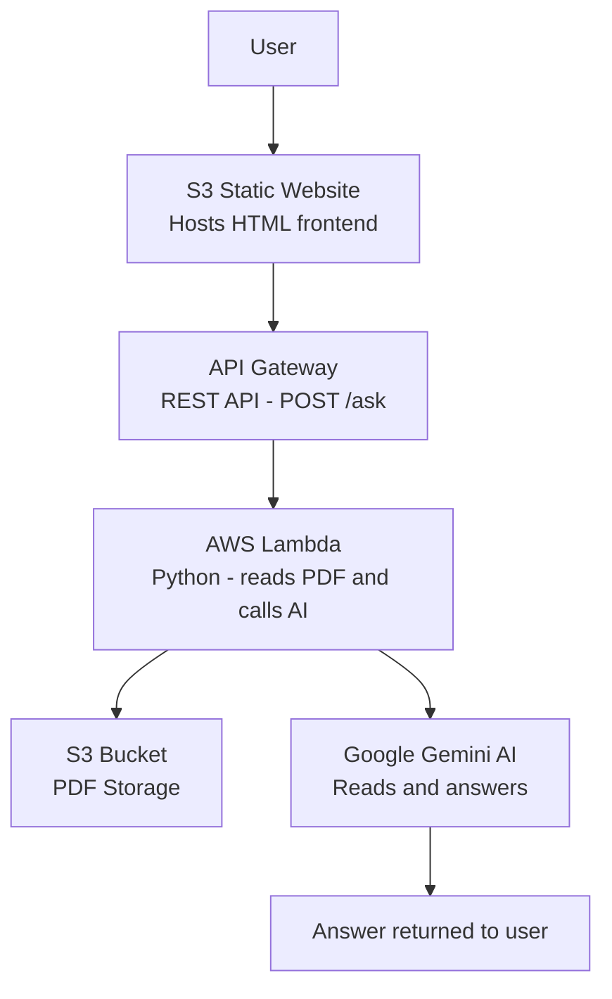

# GenAI Document Q&A Bot

## Overview
An AI-powered document Q&A system that allows users to upload PDF documents 
and ask questions about their content. Built on AWS with Google Gemini AI.

## Live Demo
http://cjgragasin.ai.project.s3-website-ap-southeast-1.amazonaws.com

## Architecture



## AWS Services Used
- **Amazon S3** — stores PDF documents and hosts the frontend website
- **AWS Lambda** — processes requests and calls Gemini AI
- **Amazon API Gateway** — creates REST API endpoint
- **AWS IAM** — manages permissions between services

## External Services
- **Google Gemini API** — AI model that reads and answers questions about PDFs
- Note: Designed for Amazon Bedrock — using Gemini as placeholder while Bedrock access is pending

## How It Works
1. User opens the S3-hosted frontend website
2. User enters PDF filename and a question
3. Frontend sends POST request to API Gateway
4. API Gateway triggers Lambda function
5. Lambda reads PDF from S3 and converts to base64
6. Lambda sends PDF + question to Gemini AI
7. Gemini reads the document and returns an answer
8. Answer is displayed on the frontend

## Cost
| Service | Cost |
|---------|------|
| Lambda | ~$0.00 |
| API Gateway | ~$0.01 |
| S3 | ~$0.01 |
| Gemini API | Free tier |
| **Total** | **~$0.02/month** |


## How to Recreate

### Step 1 — S3 Bucket for PDFs
- AWS Console → S3 → Create Bucket
- Name: your-bucket-name
- Region: ap-southeast-1
- Keep Block all public access ON
- Upload your PDF documents

### Step 2 — IAM Role
- AWS Console → IAM → Roles → Create Role
- Trusted entity: AWS Service → Lambda
- Attach policies:
  - AmazonS3FullAccess
  - CloudWatchLogsFullAccess
- Role name: genai-qna-role

### Step 3 — Lambda Function
- AWS Console → Lambda → Create Function
- Name: genai-qna-bot
- Runtime: Python 3.13
- Assign role: genai-qna-role
- Upload lambda_function.py code
- Add environment variables:
  - BUCKET_NAME: your-bucket-name
  - GEMINI_API_KEY: your-gemini-api-key
- Set timeout to 30 seconds

### Step 4 — API Gateway
- AWS Console → API Gateway → Create REST API
- Name: genai-qna-api
- Endpoint type: Regional
- Create Resource: /ask
- Enable CORS on /ask
- Create POST method with Lambda proxy integration
- Deploy to prod stage

### Step 5 — Frontend S3 Bucket
- Create a new public S3 bucket
- Upload index.html
- Enable static website hosting
- Add public bucket policy

### Step 6 — Get Gemini API Key
- Go to aistudio.google.com
- Create API key
- Add to Lambda environment variables

## Test the API
```bash
curl -X POST "https://your-api-id.execute-api.ap-southeast-1.amazonaws.com/prod/ask" \
  -H "Content-Type: application/json" \
  -d "{\"question\": \"What is this document about?\", \"filename\": \"your-file.pdf\"}"
```

## Cleanup (to avoid charges)
Delete in this order:
1. API Gateway
2. Lambda function
3. Both S3 buckets (empty first)
4. IAM role
5. CloudWatch log groups

## Skills Demonstrated
- Python (boto3, urllib, base64)
- AWS Lambda (serverless compute)
- Amazon API Gateway (REST API)
- Amazon S3 (storage + static hosting)
- AWS IAM (security and permissions)
- Google Gemini AI integration
- CORS configuration
- PDF processing
- GenAI/AI integration